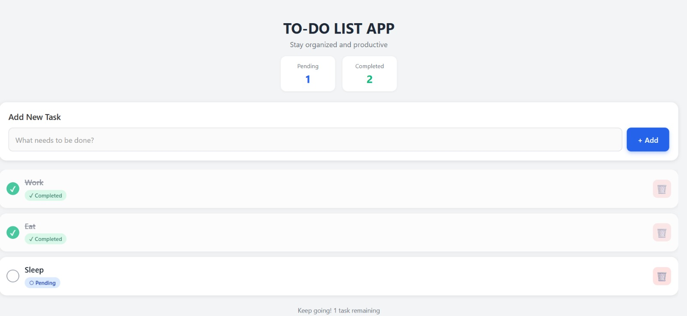
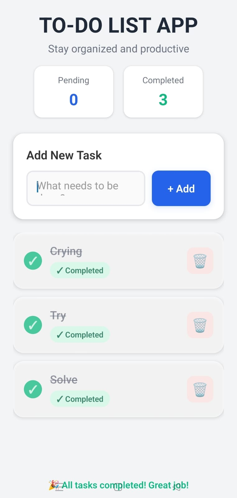

# TO-DO LIST APP - React Native

A beautiful and intuitive to-do list application built with React Native and Expo. Stay organized and manage your daily tasks efficiently with this feature-rich mobile app.


## 📱 Features

- ✅ **Add Tasks** - Quickly add new tasks with an intuitive input interface
- ✏️ **Mark as Complete** - Tap tasks to toggle between pending and completed states
- 🗑️ **Delete Tasks** - Remove tasks you no longer need
- 📊 **Real-time Counters** - Track pending and completed tasks at a glance
- 🎨 **Modern UI** - Beautiful gradient background with smooth animations
- 💾 **Persistent Storage** - Tasks are saved using AsyncStorage
- 📱 **Cross-platform** - Works on iOS and Android

##  Screenshots

  Web Interface
   

  Android Interface
   
    

##  Technologies Used

- **React Native** - Mobile app framework
- **Expo** - Development platform
- **Expo Router** - File-based routing
- **React Navigation** - Navigation library
- **AsyncStorage** - Local data persistence
- **React Hooks** - State management

##  Prerequisites

Before you begin, ensure you have the following installed:

- [Node.js](https://nodejs.org/) (v14 or higher)
- [npm](https://www.npmjs.com/) or [yarn](https://yarnpkg.com/)
- [Expo Go](https://expo.dev/client) app on your mobile device
- [Git](https://git-scm.com/)

##  Installation

1. **Clone the repository**
```bash
   git clone https://github.com/prathamjagad/task-todo.git
   cd task-todo
```

2. **Install dependencies**
```bash
   npm install
```

3. **Start the development server**
```bash
   npx expo start
```

4. **Run on your device**
   - Scan the QR code with **Expo Go** app (Android) or Camera app (iOS)
   - Or press `a` for Android emulator or `i` for iOS simulator

##  Running the App

### Development Mode
```bash
npm start
```

### Android
```bash
npm run android
```

### iOS
```bash
npm run ios
```

### Web
```bash
npm run web
```

### Clear Cache
```bash
npx expo start --clear
```

##  Project Structure
```
task-todo/
├── app/                    # App screens (Expo Router)
│   └── index.js           # Home screen
├── components/            # Reusable components
│   ├── AddTask.js        # Task input component
│   └── TaskItem.js       # Task list item component
├── assets/               # Images, fonts, icons
├── scripts/              # Utility scripts
├── .expo/                # Expo configuration
├── .vscode/              # VS Code settings
├── node_modules/         # Dependencies
├── app.json              # Expo app configuration
├── package.json          # Project dependencies
├── tsconfig.json         # TypeScript configuration
└── README.md             # Project documentation
```


### AddTask Component
Handles task input and addition functionality with a clean, modern interface.

### TaskItem Component
Displays individual tasks with:
- Checkbox for completion toggle
- Task title with strike-through effect for completed tasks
- Status badge (Pending/Completed)
- Delete button

### HomeScreen (index.js)
Main screen featuring:
- Task counters
- Task list
- Empty state UI
- Success message when all tasks completed

##  Key Features Explained

### Task Management
- **Add**: Enter task text and press "Add" or hit Enter
- **Complete**: Tap on any task to mark it as complete/incomplete
- **Delete**: Tap the trash icon to remove a task

### Visual Feedback
- Completed tasks show with strikethrough text
- Color-coded status badges (Blue: Pending, Green: Completed)
- Smooth animations and transitions
- Celebration message when all tasks are done

##  Troubleshooting

### App won't connect to Expo Go
```bash
npx expo start --tunnel
```

### Cache issues
```bash
npx expo start --clear
```

### Version mismatch errors
Make sure your Expo Go app version matches the SDK version in package.json (SDK 54)

##  Contributing

Contributions are welcome! Please feel free to submit a Pull Request.

1. Fork the project
2. Create your feature branch (`git checkout -b feature/AmazingFeature`)
3. Commit your changes (`git commit -m 'Add some AmazingFeature'`)
4. Push to the branch (`git push origin feature/AmazingFeature`)
5. Open a Pull Request

##  Author

**Pratham Jagad**

- GitHub: [@prathamjagad](https://github.com/prathamjagad)
- Email: jagadpratham@gmail.com

